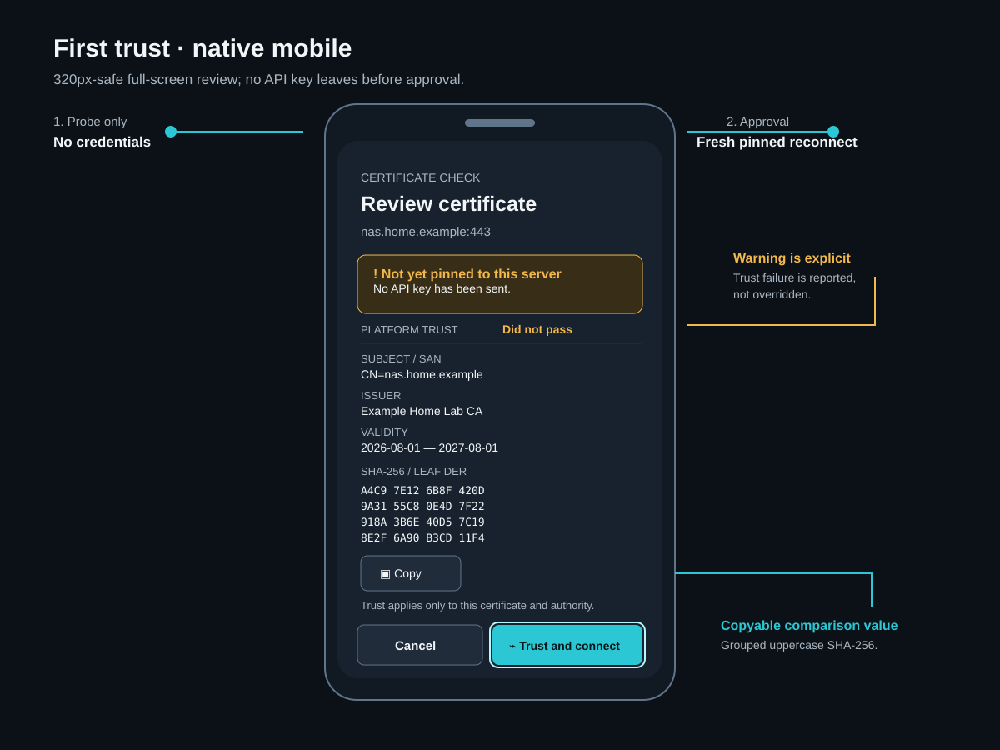
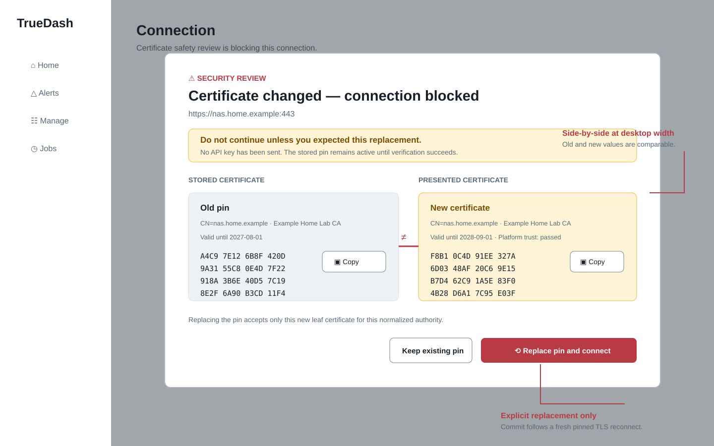
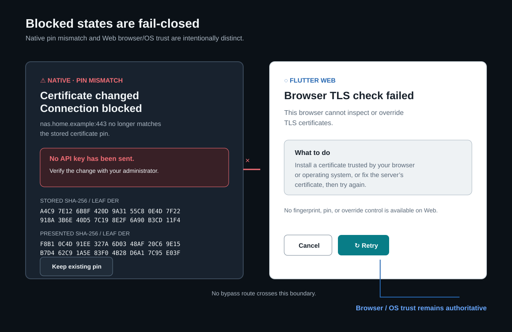

# TLS TOFU pinning mockups

These are approved planned-design review artifacts for TD-003, not evidence of a shipped capability.

The mockups are normative for content hierarchy, exact safety copy, and interaction behavior. Flutter implementation must use TrueRAID design-system semantic tokens and components, rather than copying SVG color, spacing, or typography literals.

Review checklist:

- First trust is credential-free until a fresh pinned reconnect succeeds.
- Certificate replacement visibly compares complete 64-hex SHA-256/DER values (not prefixes) and preserves the old pin on cancel/failure.
- Native and Web limitations are visibly different; Web has no trust override.
- Mobile stays 320px-safe; desktop is a bounded dialog/sheet; actions retain labels, icons, 44px targets, and 2px focus.
- Examples use only documentation-safe hostnames and fictitious fingerprints.
