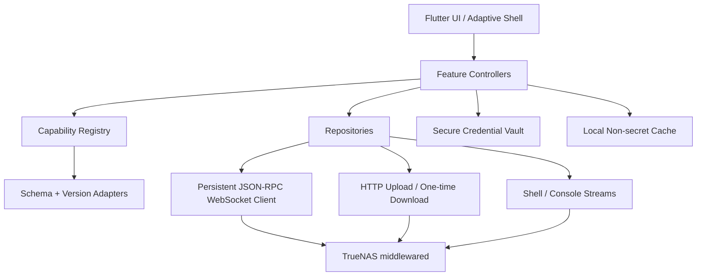

# TrueDash 제품 기획안

> 검토 기준일: 2026-09-05 (KST)
>
> 상태: Draft v0.1 — 구현 전 제품·기술 기준선
>
> 연계 문서: [`TRUEDASH_CAPABILITY_MATRIX.csv`](./TRUEDASH_CAPABILITY_MATRIX.csv)

## 1. 한 줄 정의

**TrueDash는 TrueNAS Community Edition과 Enterprise의 관리 기능을 모바일·데스크톱에서 안전하게 수행하는 비공식 크로스플랫폼 네이티브 클라이언트다.**

슬로건 초안: **Your TrueNAS. One clear control surface.**

## 2. 의사결정 요약

- 제품명은 **TrueDash**로 한다.
- v1의 릴리스 기준선은 **TrueNAS 25.10.7**로 고정한다. 25.10.7은 2026-09-02 공개된 최신 안정 유지보수 릴리스이며, 26 계열은 조사 시점 BETA다.[17][21][22]
- TrueNAS 25.04는 호환 유지 대상, 26+는 capability adapter를 둔 프리뷰 대상으로 취급한다.
- API는 25.04부터 도입된 버전형 **JSON-RPC 2.0 over WebSocket**을 기본 통신로로 삼는다.[1][2][3]
- REST 관리 API는 25.04에서 deprecated되었고 26에서 제거되므로 신규 기능 구현에 사용하지 않는다.[2][21]
- v1 플랫폼은 **Android, iOS, macOS, Windows, Linux** 네이티브 앱이다. 브라우저/PWA는 인증서·브라우저 보안 제약 때문에 v1 릴리스 게이트에서 제외한다.
- 앱은 기본적으로 TrueNAS 장비와 직접 통신한다. TrueDash 계정이나 중계 서버는 두지 않는다. 원격 접속은 사용자가 구성한 VPN/Tailscale/정식 TLS 경로를 사용한다.
- “전체 기능 동작”은 화면 수가 아니라 **기능 패리티 원장 + 실제 TrueNAS 인스턴스 E2E 증거**로 판정한다.
- LabFox의 코드를 포크하거나 상표·아이콘을 재사용하지 않는다. 폭 기반 적응형 구조, 정보 밀도, 상태 표현, 디자인 토큰 원칙만 참고한다. LabFox 소스는 Apache-2.0이지만 이름과 로고의 상표 권리는 별도다.[11][15]
- TrueNAS WebUI 소스는 GPL-3.0이므로 코드·컴포넌트 복사 없이 공개 API와 관찰된 동작을 기준으로 독립 구현한다.[16]

## 3. 문제 정의

TrueNAS 웹 콘솔은 기능이 강력하지만 다음 상황에서 운영 동선이 길다.

1. 모바일에서 경보 확인, 앱 재시작, 작업 실패 원인 확인 같은 짧은 조작이 번거롭다.
2. 여러 TrueNAS 인스턴스를 전환하며 상태를 비교하기 어렵다.
3. 스토리지·네트워크·권한 변경은 파괴 가능성이 높은데, 작은 화면에서 영향 범위와 진행 상태를 놓치기 쉽다.
4. TrueNAS 버전과 에디션에 따라 API·화면·역할이 달라져 서드파티 앱이 쉽게 깨진다.
5. 웹 화면을 그대로 축소하면 모바일 사용성이 나빠지고, 기능을 줄이면 “완전한 관리 클라이언트”가 되지 못한다.

공개된 기존 모바일 클라이언트 TrueControl은 통계·Apps·Pool 모니터링과 Apps 시작/중지를 중심으로 소개된다.[20] TrueDash는 이 제한된 모니터링 범주가 아니라 WebUI 전체 capability 패리티를 차별점으로 삼는다.

## 4. 제품 목표와 비목표

### 4.1 목표

1. **기능 패리티:** 연결된 서버가 지원하고 현재 사용자 역할이 허용하는 모든 WebUI 관리 기능 제공.
2. **운영 속도:** 경보 확인→원인 화면→조치→작업 결과 확인을 한 흐름으로 연결.
3. **안전성:** 위험한 변경은 영향 요약, 재인증, 명시적 확인, 진행 추적, 감사 가능성을 제공.
4. **버전 내성:** 하드코딩된 메뉴보다 서버 capability와 메서드 스키마를 우선.
5. **멀티 인스턴스:** 서버별 상태·인증서·자격 증명·표시 설정을 분리.
6. **네이티브 적응형 UX:** 휴대폰부터 넓은 데스크톱까지 같은 기능을 폭에 맞게 재배치.
7. **접근성:** 색상 단독 의미 전달 금지, 키보드·스크린리더·확대 글꼴 지원.

### 4.2 비목표

- TrueNAS 자체 기능을 앱 내부에서 재구현하지 않는다.
- 파일 동기화, 사진 백업, 미디어 플레이어를 v1 핵심 범위에 포함하지 않는다.
- TrueDash 자체 클라우드 중계·계정·텔레메트리를 필수화하지 않는다.
- 지원하지 않는 API를 SSH 명령 실행으로 우회해 정상 기능처럼 제공하지 않는다.
- TrueNAS 또는 LabFox의 공식 제품으로 오인시키는 브랜드 표현을 사용하지 않는다.
- `filesystem` API가 파일 조회·목록·업로드 기능을 제공하더라도 범용 파일 관리자는 WebUI 패리티가 아닌 후속 value-add로 분리한다.[18]

## 5. 타깃 사용자와 핵심 JTBD

### 5.1 홈랩 운영자

- 외부에서 경보와 용량 상태를 빠르게 확인하고 싶다.
- Apps·VM·Container를 재시작하고 로그를 확인하고 싶다.
- 여러 장비를 한 앱에서 전환하고 싶다.

### 5.2 소규모 조직 관리자

- 사용자·공유·백업·복제 작업을 모바일과 데스크톱에서 동일하게 관리하고 싶다.
- 역할이 제한된 운영자에게 허용된 기능만 안전하게 노출하고 싶다.

### 5.3 Enterprise 운영자

- HA, Enclosure/JBOF, FC, KMIP, IPMI 상태와 작업을 노드 인지형 UI에서 수행하고 싶다.
- 감사 로그와 지원 번들을 포함한 장애 대응 흐름을 유지하고 싶다.

### 5.4 핵심 작업 흐름

```text
알림 수신/대시보드 확인
  → 영향받은 리소스 상세
  → 권장 또는 수동 조치
  → 작업(Job) 진행률·로그
  → 성공/실패 결과
  → 감사 로그·재시도·후속 조치
```

## 6. 조사 결과와 범위 기준

TrueNAS 최신 WebUI 소스의 1차 내비게이션은 Dashboard, Storage, Datasets, Shares, Data Protection, Credentials, Containers, Virtual Machines, Apps, Reporting, System으로 구성된다. Credentials와 System은 하위 메뉴를 가지며 라이선스·역할에 따라 일부 메뉴가 조건부 노출된다.[7] 실제 관리자 라우트에는 Jobs, 2FA, Audit, Shell 등 전역·보조 화면도 포함된다.[8]

공식 25.10 UI Reference는 SMB/NFS/iSCSI/FC/NVMe-oF, 스냅샷·복제·클라우드 동기화, AD/IPA/LDAP/Kerberos, Containers/VM/Apps, Reporting, System Settings를 폭넓게 다룬다.[9]

이번 조사에서 TrueNAS WebUI의 비테스트 TypeScript를 정적으로 스캔한 결과 **72개 네임스페이스, 593개 고유 API 호출 문자열**이 검출됐다. 이는 공식 API 전체 개수가 아니라 현재 WebUI 코드가 참조하는 정적 하한선이다. 동적 조합 호출이나 에디션별 호출은 별도 발견이 필요하다.

따라서 범위는 다음 두 축을 동시에 만족해야 한다.

- **UI 패리티 축:** WebUI 메뉴·라우트·사용자 작업 흐름.
- **API 패리티 축:** 서버가 `core.get_methods`로 노출하는 메서드, 역할, 입력·출력 스키마, job/upload/download 속성. 이 메서드는 사용 가능한 서비스의 메서드 메타데이터를 반환한다.[4]

## 7. 전체 기능 정보 구조

### 7.1 전역 셸

- 서버 전환기와 전체 상태 인디케이터
- 전역 검색/명령 팔레트
- Alerts
- Jobs
- 현재 사용자, 비밀번호, API Keys, 2FA, 세션, 로그아웃
- 업데이트/재부팅 필요 상태
- 네트워크 변경 확인 카운트다운
- 디렉터리 서비스, resilver, replication, HA 상태
- 도움말, API 문서, About, 지원/피드백
- Shutdown, Restart, HA failover

### 7.2 Dashboard

- 시스템 정보, 버전, 에디션, uptime
- CPU, 메모리, 온도, 부하
- Pool 상태·용량·경고
- 네트워크 인터페이스·트래픽
- Apps/VM/Container 요약
- 활성 Jobs와 Alerts
- 위젯 표시·정렬·서버별 로컬 설정

### 7.3 Storage

- Pool 조회, 생성, 가져오기, 내보내기
- VDEV 토폴로지 설계와 검증
- 데이터/스페어/캐시/로그/스페셜/중복제거 VDEV
- 디스크 목록, 상태, drive-health 정보, SED, wipe. 25.10에서 제거된 내장 SMART 테스트 스케줄링·모니터링 UI는 패리티 대상이 아니다.[21]
- attach/detach/offline/online/replace/remove/extend
- scrub, expand, feature upgrade, 옵션 변경
- resilver 상태와 오류
- 암호화·복구 키/패스프레이즈

### 7.4 Datasets

- Dataset tree, 생성·수정·이름 변경·삭제
- Zvol 생성·수정·삭제
- presets, compression, sync, record/block size
- quota/refquota/reservation
- 사용자/그룹 quota
- lock/unlock, 암호화 상속과 키 관리
- POSIX/NFSv4 ACL, 소유자·그룹, 재귀 적용
- snapshot 생성·복제·rollback·hold·delete

### 7.5 Shares

- 공유 대시보드와 관련 서비스 상태
- SMB CRUD, presets, Time Machine, private dataset, shadow copy, multichannel, 세션
- NFS CRUD, hosts/networks, maproot/mapall, snapshot 노출, 세션
- iSCSI global/portal/initiator/target/extent/auth/mapping
- NVMe-oF subsystem/port/host/namespace/ANA
- WebShare
- Fibre Channel(Enterprise/하드웨어 게이트)

### 7.6 Data Protection

- 보호 작업 상태 대시보드
- periodic snapshot tasks
- replication local/remote, push/pull, encryption, resume
- cloud sync 및 provider-specific schema
- TrueCloud Backup, restore, retention
- rsync tasks
- VMware snapshot tasks
- 수동 실행, 중단, 실패 로그, 다음 실행 시간

### 7.7 Credentials

- local users/groups
- privileges와 effective roles
- AD/LDAP/IPA
- Kerberos realm/keytab/settings
- ID mapping
- cloud credentials
- SSH keypair/connection credentials와 host-key trust
- certificates, CA, CSR, ACME DNS authenticators
- KMIP(Enterprise)

TrueNAS의 API 권한은 RBAC이며 세션의 역할이 각 메서드 호출에 검사된다. 대표 상위 역할은 FULL_ADMIN, READONLY_ADMIN, SHARING_ADMIN, REPLICATION_ADMIN이다.[10] TrueDash는 버튼 비활성화만으로 끝내지 않고 현재 사용자에게 없는 권한과 필요한 역할을 설명해야 한다.

### 7.8 Apps

- Apps pool 구성·이전
- catalog refresh/discover/search/category/detail
- install/custom install/edit/upgrade/rollback/delete
- start/stop/restart/redeploy
- 동적 앱 설정 schema
- portal/notes
- container logs follow/download/shell
- Docker images와 registries

### 7.9 Containers

- container create/clone/edit/delete
- start/stop/restart
- CPU/memory/disk/network 제한
- NIC/GPU/USB/device 관리
- shell과 console

### 7.10 Virtual Machines

- VM create/clone/edit/delete
- start/stop/restart/poweroff
- UEFI/BIOS, CPU/memory/autostart
- disk/NIC/display/PCI/GPU/USB/CD-ROM devices
- serial console와 display session

### 7.11 Reporting

- CPU, load, memory, disk, network, ZFS, system, UPS
- 기간, 집계, 단위, timezone
- 실시간 스트림과 과거 조회
- 결측·연결 끊김 표시

### 7.12 System

- update train/check/download/install/manual upload
- general: localization, GUI/TLS, email, support
- advanced: console, syslog, kernel, isolated GPU, system dataset, telemetry/data settings
- network: global config, interfaces, bridge/LAGG/VLAN, routes, IPv6, pending change check-in
- IPMI
- boot environments와 boot pool
- services 설정·시작·중지·enable
- system shell
- cron, tunables, init/shutdown scripts
- alert settings와 alert services
- audit log 조회·필터·export·retention
- enclosure/JBOF identify와 slot actions
- configuration backup/restore/factory reset
- support ticket/debug bundle/license/EULA
- TrueNAS Connect/TrueCommand
- HA/failover/node-aware operations

상세 수용 범위는 88개 capability row로 분해한 `TRUEDASH_CAPABILITY_MATRIX.csv`를 단일 패리티 원장으로 사용한다.

## 8. UX 구조 — LabFox 원칙을 TrueDash에 적용

LabFox는 하나의 Flutter 코드베이스에서 OS가 아니라 **폭**으로 레이아웃을 결정하고, 600px 이상은 tablet, 1000px 이상은 desktop으로 분기한다.[13] TrueDash도 이 원칙을 사용하되 데이터 밀도가 더 높은 NAS 관리 화면에 맞게 세 구간을 정의한다.

| 폭 | 구조 | TrueDash 동작 |
|---|---|---|
| `<600` | 모바일 단일 pane | 하단 4개 목적지 + 전체 메뉴 sheet, 상세 화면 push, 위험 작업 full-screen stepper |
| `600–999` | tablet 2-pane | navigation rail + 목록/상세, inspector sheet |
| `≥1000` | desktop 3-pane 가능 | 확장 rail + 목록 + 상세/작업 inspector, command palette, 다중 차트 |

### 8.1 모바일 1차 목적지

1. **Home** — 현재 서버 핵심 상태
2. **Alerts** — 조치가 필요한 항목
3. **Manage** — Storage/Datasets/Shares/Protection/Compute/System 전체 메뉴
4. **Jobs** — 실행 중·실패·완료 작업

서버 전환과 Search는 상단 전역 액션으로 둔다. 11개 WebUI 1차 메뉴를 하단에 그대로 넣지 않는다.

### 8.2 디자인 토큰

LabFox는 4/8/16/24/32/48 간격과 최소 44px 터치 타깃을 사용한다.[14] TrueDash는 이를 기초로 다음 토큰을 독립 정의한다.

- spacing: `4, 8, 12, 16, 24, 32, 48`
- radius: `4, 8, 12, pill`
- touch target: 최소 `44×44`
- 표준 행 높이: mobile `56`, compact desktop `44`
- light: paper-white + cool gray hairline
- dark: graphite/navy-black + slate hairline
- primary accent: **TrueDash Cyan** 계열(브랜드 확정 전 임시)
- success/warning/error/info는 아이콘+라벨+색을 항상 함께 사용
- 차트 색은 light/dark 및 색각 이상 팔레트로 별도 검증

LabFox의 light/dark 테마는 중립 surface를 중심에 두고 브랜드 색은 primary action과 active state에 제한한다.[12] TrueDash도 장시간 운영 화면의 피로를 줄이기 위해 넓은 브랜드색 배경을 쓰지 않는다.

### 8.3 핵심 컴포넌트

- `ServerSwitcher`: 상태, 인증서, 버전, 에디션
- `HealthPill`: 아이콘+텍스트+색
- `ResourceRow`: 이름, 유형, 상태, 메타데이터, quick action
- `CapacityBar`: used/available/reserved/warning threshold
- `MetricCard`: value, sparkline, time range, stale indicator
- `JobDrawer`: 진행률, 단계, 로그, 취소, 관련 리소스
- `ImpactPreview`: 변경 전/후, 영향 서비스, 연결 끊김 가능성
- `DangerConfirm`: 리소스명 입력, 재인증, 최종 실행
- `SchemaForm`: 서버 API schema 기반 필드 + 버전 adapter
- `AnsiLogView`: follow/pause/search/copy/download
- `TerminalSurface`: reconnect/resize/paste guard/clipboard warning
- `CapabilityNotice`: 미지원 버전·에디션·역할 이유

## 9. 기술 아키텍처

### 9.1 선택

**Flutter modular monolith + 순수 Dart API packages**를 권장한다. LabFox와 같은 폭 기반 반응형 모델과 단일 코드베이스의 이점을 얻되, TrueDash 디자인 시스템과 도메인 모델은 독립 구현한다.[11]



### 9.2 권장 모노레포

```text
TrueDash/
├── apps/truedash/                    # Flutter application
├── packages/truenas_api/             # JSON-RPC, reconnect, events, jobs, files, terminal
├── packages/truenas_models/          # generated DTO + stable domain entities
├── packages/truenas_capabilities/    # version/edition/role feature registry
├── packages/truedash_design_system/  # tokens and reusable components
├── packages/secure_vault/            # Keychain/Keystore/Credential Manager/libsecret
├── packages/test_lab/                # real-server fixtures and E2E driver
├── docs/planning/
├── docs/api/
└── tools/schema_sync/                 # core.get_methods snapshot/diff/codegen
```

### 9.3 연결과 버전 협상

1. URL 정규화 없이 사용자가 입력한 host를 보존한다.
2. TLS 인증서 체인을 검증한다.
3. self-signed면 fingerprint, subject, SAN, validity를 보여주고 명시적 TOFU 승인을 받는다.
4. `wss://<host>/api/current`에 persistent connection을 만든다.
5. 서버 정보와 버전을 조회한다.
6. 25.04/25.10/26 adapter를 선택한다.
7. `core.get_methods`에서 method schema, roles, job/upload/download 속성을 읽어 capability registry를 만든다.[4]
8. 로그인 후 `auth.me`의 역할과 서버 에디션·라이선스·하드웨어 capability를 결합한다.
9. 이벤트를 구독하고 초기 query와 이벤트 사이의 gap을 resync한다.
10. 재연결 시 idempotent read만 자동 재시도하고 mutation은 결과 확인 후 사용자에게 상태를 제시한다.

### 9.4 API 계층 필수 기능

- JSON-RPC request id correlation
- structured error/validation error mapping
- persistent connection와 backoff/jitter reconnect
- event subscribe/unsubscribe와 collection update reducer
- keepalive와 foreground/background resume
- job start, progress, result, error, abort, reconnect recovery
- HTTP `/_upload`·`/_download` 전송과 time-limited single-use download
- host/app/container/VM shell·console의 전용 WebSocket stream와 resize.[19]
- query filter/options builder
- rate-limit 보호와 bulk operation
- structured redaction: key/password/token/private key를 log·analytics·crash report에서 제거

공식 Jobs 문서는 장시간 작업의 상태 조회와 파일 upload/download 절차를 별도로 정의한다.[5] 공식 클라이언트는 반복 호출보다 하나의 지속 WebSocket 연결을 권장하며 인증/비인증 호출 rate limit도 명시한다.[6]

### 9.5 상태 관리

- Riverpod 사용
- 서버별 normalized entity cache
- source of truth는 서버이며 로컬 cache는 stale 표시가 있는 read optimization
- optimistic update는 비파괴적 토글에만 제한
- storage/network/auth mutation은 서버 응답 또는 job 성공 전까지 완료로 표시하지 않음
- 앱 background 복귀 시 critical collection resync

## 10. 인증·보안 원칙

1. **WSS 기본:** 25.04/25.10의 PLAIN API-key 인증은 검증된 TLS에서만 허용.
2. **26+ SCRAM 우선:** 26 이상에서 지원하는 SCRAM-SHA-512와 channel binding을 기본 사용하고 자동 downgrade하지 않음.[6]
3. **비밀번호 비저장 기본:** 초기 로그인 후 사용자가 생성한 최소권한 API key 사용을 권장.
4. **OS 보안 저장소:** API key, reconnect token, private material은 플랫폼 secure vault에 저장.
5. **인증서 pinning:** 승인되지 않은 인증서 변경은 차단. “계속” 한 번으로 우회하지 않음.
6. **최소권한:** 서버 역할별 기능을 숨기기보다 read-only/denied 이유를 명확히 표시.
7. **파괴적 작업:** typed confirmation + 영향 요약 + 필요 시 재인증.
8. **네트워크 잠금 방지:** interface/global config 변경은 TrueNAS check-in/revert 흐름을 그대로 구현.
9. **비밀 redaction:** 입력 필드, 로그, crash dump, clipboard, 화면 캡처 민감도 처리.
10. **감사:** mutation의 대상·시각·server/job id를 로컬 activity에 남기되 비밀은 저장하지 않음.
11. **SSH 우회 금지:** API 미지원 기능은 `Unsupported`로 표시하고 parity blocker로 추적.
12. **공급망:** pinned dependencies, SBOM, signed release, secret scanning, reproducible build 목표.

## 11. 위험 작업 UX 등급

| 등급 | 예시 | 필수 보호 |
|---|---|---|
| R0 조회 | dashboard/reporting | 즉시 실행, stale 표시 |
| R1 가역 변경 | widget, 비핵심 service toggle | 변경 요약, undo 가능 시 제공 |
| R2 영향 가능 | share/service/app restart | 영향 리소스, 확인, job 추적 |
| R3 데이터/접속 위험 | ACL 재귀, network, pool export, VM force stop | typed confirm, 재인증, rollback/check-in 안내 |
| R4 파괴적 | disk wipe, dataset/pool delete, factory reset | 리소스명+데이터 영향+백업 경고+재인증+최종 hold action |

## 12. 데이터 모델 핵심

```text
ServerProfile
- stableServerId, displayName, baseUri
- tlsPolicy, pinnedFingerprint
- detectedVersion, edition, capabilities
- credentialRef (secure-vault pointer only)

Capability
- id, supported, reason
- apiMethod, min/maxVersion
- requiredRoles, editionGate, hardwareGate
- job/upload/download/stream flags

Operation
- localOperationId, serverId, method, resourceRef
- riskLevel, startedAt, rpcId, jobId
- state, progress, error, auditReference
```

## 13. 오류·오프라인 전략

- 연결 끊김: 마지막 갱신 시각과 stale banner 표시.
- foreground 복귀: 연결 재수립→인증 복구→critical queries→subscriptions 재등록.
- mutation 응답 유실: 같은 요청 자동 재전송 금지. 대상 상태와 job 목록을 조회해 `Succeeded/Failed/Unknown` 판정.
- schema mismatch: 화면 crash 대신 capability notice와 진단 export.
- job event 유실: `core.get_jobs` 재조회로 보정.
- server reboot/update: 예상 disconnect로 분류하고 boot 재연결 단계 표시.
- TLS mismatch: 네트워크 오류로 뭉개지 않고 별도 보안 차단 화면 제공.
- 대용량 로그: windowed rendering, backpressure, follow pause, 파일 download.

## 14. 테스트 및 “전체 동작” 완료 기준

### 14.1 테스트 랩

- TrueNAS 25.04 최신 maintenance VM
- TrueNAS 25.10.7 VM — v1 기준
- TrueNAS 26.x BETA/RC VM — preview adapter
- 단일 디스크 테스트가 아니라 disposable virtual disks로 pool/VDEV/dataset 실작업
- 별도 원격 TrueNAS로 replication/SSH/cloud path 검증
- Enterprise HA/FC/KMIP/Enclosure/JBOF/IPMI는 실제 또는 공급받은 지원 하드웨어 랩 필요

### 14.2 테스트 층

1. **Protocol tests:** JSON-RPC correlation, errors, reconnect, subscriptions.
2. **Schema contract tests:** `core.get_methods` snapshot diff와 generated model compile.
3. **Repository integration tests:** 실제 middlewared에 CRUD/job/upload/download.
4. **Feature E2E:** capability matrix 각 행의 A/E/X.
5. **Golden/accessibility tests:** mobile/tablet/desktop, light/dark, ko/en, 확대 글꼴.
6. **Chaos tests:** network flap, server reboot, certificate rotation, job event loss, HA failover.
7. **Security tests:** secret leakage, TLS downgrade, pin mismatch, role denial, malicious field/log text.
8. **Release artifact tests:** signed packages, clean install, upgrade, secure-vault migration.

### 14.3 A/E/X 규칙

- **A (Allowed):** 정상 권한·정상 입력에서 실제 상태 변경과 readback 확인.
- **E (Edge):** 빈 데이터, 큰 목록, 장시간 job, 느린 연결, 부분 capability, 재연결.
- **X (Exceptional):** 권한 거부, validation error, 충돌, TLS mismatch, 서버 중단, job 실패.

### 14.4 Release Definition of Done

- `TRUEDASH_CAPABILITY_MATRIX.csv`의 현재 서버에 Applicable인 모든 row가 Pass.
- 미지원 row는 서버 capability/edition/hardware 근거와 사용자-facing reason이 있음.
- 정적 API 호출 inventory 대비 누락이 0이거나 명시적 `Not Applicable` 결정 기록이 있음.
- 모든 mutation은 성공 후 exact-target readback 또는 job result로 검증됨.
- R3/R4 작업은 안전 UX 테스트 통과.
- 25.10.7에서 blocker/P0/P1 결함 0.
- 25.04 호환 테스트 통과.
- 26 preview의 known incompatibility가 adapter 문서에 기록됨.
- Android/iOS/macOS/Windows/Linux의 설치·로그인·핵심 E2E 통과.
- 접근성, 한국어/영어, light/dark 검증 통과.
- 비밀이 log/crash report/analytics에 포함되지 않음.

## 15. 개발 로드맵

> 가정: Flutter 3명, API/인프라 1명, QA 자동화 1명, 제품·디자인 1명 수준의 전담 팀. 30주는 계산상 약 6.9개월이며 Enterprise 실장비 확보와 앱스토어 심사는 별도 변동 요인이다.

| 단계 | 기간 | 산출물 | Exit gate |
|---|---:|---|---|
| M0 계약·랩 | 2주 | repo, CI, TrueNAS VM matrix, schema snapshot, parity ledger | 3개 버전 연결·schema diff |
| M1 기반 | 3주 | adaptive shell, multi-server, TLS pinning, auth/2FA/RBAC | 재연결·인증 보안 테스트 |
| M2 관측 | 4주 | dashboard, alerts, jobs, reporting, global search | 실시간 event/job recovery |
| M3 데이터 | 4주 | storage, disks, VDEVs, datasets, snapshots, ACL | disposable pool destructive E2E |
| M4 서비스 | 4주 | shares 전 범위, services, credentials, directory services | protocol별 CRUD와 권한 테스트 |
| M5 보호 | 4주 | snapshot tasks, replication, cloud sync/backup, rsync, VMware | 실제 원격 전송·복구 E2E |
| M6 컴퓨트 | 4주 | Apps, Docker, Containers, VMs, logs/shell/console | lifecycle·stream·device E2E |
| M7 시스템·Enterprise | 3주 | update/network/boot/audit/support/HA/Enclosure/KMIP/FC/IPMI | 하드웨어별 evidence 또는 blocker |
| M8 패리티 하드닝 | 2주 | 전체 ledger closure, security/accessibility/store artifacts | DoD 전 항목 통과 |

M2 이후 내부 alpha, M5 이후 제한 beta는 가능하지만 **“full-function v1” 표기는 M8 패리티 게이트 통과 후에만** 사용한다.

## 16. 구현 에픽

1. E01 Repository/CI/Test Lab
2. E02 JSON-RPC Core
3. E03 Auth/TLS/Secure Vault
4. E04 Capability Registry/Schema Codegen
5. E05 Adaptive Shell/Design System
6. E06 Global Alerts/Jobs/Search/Power
7. E07 Dashboard/Reporting
8. E08 Storage/Disks/VDEVs
9. E09 Datasets/Zvol/Snapshots/ACL
10. E10 Shares
11. E11 Data Protection
12. E12 Credentials/Directory Services/Certificates
13. E13 Apps/Docker
14. E14 Containers
15. E15 Virtual Machines
16. E16 System/Network/Boot/Services/Shell/Audit
17. E17 Enterprise/Hardware Features
18. E18 Accessibility/Localization
19. E19 Security/Chaos/Parity Closure
20. E20 Packaging/Signing/Store Release

각 에픽은 capability matrix row를 acceptance criteria로 연결하고, 구현 PR은 해당 row의 자동화 evidence를 포함해야 한다.

## 17. 성공 지표

### North Star

**주간 성공 운영 작업 수(Weekly Verified Operations):** 사용자가 시작하고 서버 readback/job result까지 성공이 검증된 운영 작업 수.

### 지원 지표

- alert-to-action 완료 시간
- mutation success/unknown/failure 비율
- 연결 복구 성공률과 평균 복구 시간
- capability matrix pass 비율
- crash-free sessions
- R3/R4 취소·오작동·unknown outcome 비율
- 서버별 주간 활성 운영자

단순 화면 조회 수나 설치 수는 핵심 성공 지표로 사용하지 않는다.

## 18. 주요 위험과 대응

| 위험 | 영향 | 대응 |
|---|---|---|
| API schema/version drift | 화면·mutation 파손 | runtime discovery, generated snapshots, version adapters, nightly contract test |
| 26 인증 변화 | 로그인 실패·downgrade 위험 | SCRAM 우선, 명시적 legacy policy, 자동 downgrade 금지 |
| self-signed TLS | MITM 또는 onboarding 이탈 | fingerprint TOFU + pinning + 인증서 교체 절차 |
| 모바일에서 파괴적 오조작 | 데이터 손실 | risk tier, typed confirm, re-auth, impact preview |
| 네트워크 설정으로 자기 자신 차단 | 관리 불능 | pending change timer, check-in/revert UX, 현재 연결 경로 경고 |
| Enterprise 실장비 부재 | “전체 기능” 검증 불가 | 초기부터 장비 파트너/랩 확보, 미검증 기능은 출시 패리티로 주장하지 않음 |
| GPL 코드 오염 | 배포 라이선스 위험 | clean-room API implementation, source-copy 금지, provenance review |
| 너무 큰 범위 | 품질·일정 붕괴 | capability row 단위 완료, milestone exit gate, 미완료 기능 숨김이 아니라 명확한 beta 분리 |
| 앱스토어 정책 | shell 기능 제한 가능 | 플랫폼별 정책 검토, desktop full shell, mobile entitlement/description 사전 검증 |

## 19. 오픈 결정 사항

구현 시작 전에 다음을 확정한다.

1. v1 공개 라이선스: Apache-2.0 권장 여부.
2. 상용화: 완전 무료, 후원, 또는 모바일 유료 기능 여부.
3. Linux를 공식 스토어/패키지 릴리스 게이트에 포함할지 여부.
4. 원격 알림을 위해 선택형 자체 호스팅 push relay를 후속 버전에서 허용할지 여부.
5. Enterprise 실장비와 TrueNAS 상표 검토 경로 확보 여부.
6. 브랜드 accent와 아이콘. “TrueDash”가 TrueNAS 공식 앱으로 오인되지 않도록 **Unofficial client for TrueNAS** 문구 필요.

## 20. 착수 순서

1. `docs/api/PROTOCOL.md`에 JSON-RPC, auth, event, job, upload/download, shell의 A/E/X 계약 작성.
2. 25.04/25.10/26 테스트 VM과 disposable disk fixture 구축.
3. `core.get_methods` snapshot 수집기와 schema diff CI 작성.
4. capability matrix의 `gate`를 기계 판정 가능한 manifest로 변환.
5. TrueDash 디자인 시스템과 3개 폭 shell의 검증 가능한 prototype 제작.
6. 연결→TLS→로그인→Dashboard→Alerts→Jobs vertical slice 구현.
7. M2 gate 통과 후 Storage부터 capability row 순으로 확장.

## 21. 최종 권고

TrueDash는 “예쁜 모바일 모니터”가 아니라 **TrueNAS의 버전·권한·작업 모델을 이해하는 운영 클라이언트**로 설계해야 한다. UI는 LabFox처럼 작업 중심으로 재구성하되, 완전성은 서버 capability에서 생성되는 패리티 원장으로 증명한다. v1을 25.10.7에 고정하고 25.04/26을 adapter로 분리해야 범위가 통제되며, Enterprise 기능은 실장비 evidence 없이는 완료로 선언하지 않는다.

## Sources

[1] https://api.truenas.com
[2] https://www.truenas.com/docs/scale/api
[3] https://api.truenas.com/v25.10.0/jsonrpc.html
[4] https://api.truenas.com/v25.10.0/api_methods_core.get_methods.html
[5] https://api.truenas.com/v25.10.0/jobs.html
[6] https://github.com/truenas/api_client/blob/5427b53766747e274650625f29c06c8ae7917966/README.md
[7] https://github.com/truenas/webui/blob/5ebcbc79b0f5f9a3bae4fa6d32ac3eff802cefdb/src/app/services/navigation/navigation.service.ts
[8] https://github.com/truenas/webui/blob/5ebcbc79b0f5f9a3bae4fa6d32ac3eff802cefdb/src/app/admin.routes.ts
[9] https://www.truenas.com/docs/scale/25.10/scaleuireference/printpreview
[10] https://github.com/truenas/middleware/blob/36d7b41a/src/middlewared_docs/docs/rbac.rst
[11] https://github.com/labfox-app/labfox/blob/63ff7e09be4fb7a75b6643d160a40fbd0b74be7b/README.md
[12] https://github.com/labfox-app/labfox/blob/63ff7e09be4fb7a75b6643d160a40fbd0b74be7b/packages/design_system/lib/src/theme/labfox_theme.dart
[13] https://github.com/labfox-app/labfox/blob/63ff7e09be4fb7a75b6643d160a40fbd0b74be7b/packages/design_system/lib/src/tokens/breakpoints.dart
[14] https://github.com/labfox-app/labfox/blob/63ff7e09be4fb7a75b6643d160a40fbd0b74be7b/packages/design_system/lib/src/tokens/spacing.dart
[15] https://github.com/labfox-app/labfox/blob/63ff7e09be4fb7a75b6643d160a40fbd0b74be7b/LICENSE
[16] https://github.com/truenas/webui/blob/5ebcbc79b0f5f9a3bae4fa6d32ac3eff802cefdb/LICENSE
[17] https://www.truenas.com/docs/softwarestatus
[18] https://api.truenas.com/v25.10.0/api_methods_filesystem.html
[19] https://api.truenas.com/v25.10.0/api_methods_core.resize_shell.html
[20] https://github.com/Michael-128/TrueControl
[21] https://www.truenas.com/docs/scale/25.10/gettingstarted/versionnotes
[22] https://forums.truenas.com/t/truenas-25-10-7-is-now-available/67740
